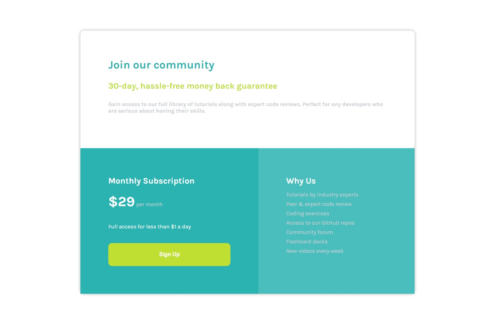
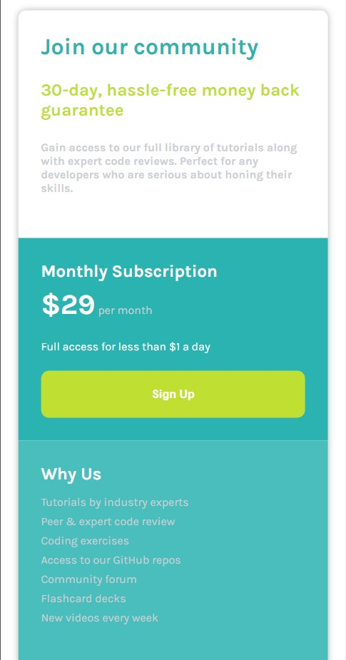

# Frontend Mentor - Single price grid component solution

This is a solution to the [Single price grid component challenge on Frontend Mentor](https://www.frontendmentor.io/challenges/single-price-grid-component-5ce41129d0ff452fec5abbbc). Frontend Mentor challenges help you improve your coding skills by building realistic projects.

## Table of contents

- [Overview](#overview)
  - [The challenge](#the-challenge)
  - [Screenshot](#screenshot)
  - [Links](#links)
- [My process](#my-process)
  - [Built with](#built-with)
  - [What I learned](#what-i-learned)

## Overview

### The challenge

Users should be able to:

- View the optimal layout for the component depending on their device's screen size
- See a hover state on desktop for the Sign Up call-to-action

### Screenshot





### Links

- Solution URL: [Add solution URL here](https://your-solution-url.com)
- Live Site URL: [Add live site URL here](https://your-live-site-url.com)

## My process

### Built with

- Semantic HTML5 markup
- CSS custom properties
- Flexbox
- CSS Grid
- Mobile-first workflow

### What I learned

This was usefull challenge.

```html
<div class="main">
  <div class="part-1">
    <h1>Join our community</h1>

    <h2>30-day, hassle-free money back guarantee</h2>

    <p>
      Gain access to our full library of tutorials along with expert code
      reviews. Perfect for any developers who are serious about honing their
      skills.
    </p>
  </div>

  <div class="part-2">
    <h2>Monthly Subscription</h2>

    <h4><span>&dollar;29</span> per month</h4>

    <p>Full access for less than &dollar;1 a day</p>

    <button>Sign Up</button>
  </div>

  <div class="part-3">
    <h2>Why Us</h2>

    <ul>
      <li>Tutorials by industry experts</li>
      <li>Peer &amp; expert code review</li>
      <li>Coding exercises</li>
      <li>Access to our GitHub repos</li>
      <li>Community forum</li>
      <li>Flashcard decks</li>
      <li>New videos every week</li>
    </ul>
  </div>
</div>
```

```css
* {
  margin: 0;
  padding: 0;
  box-sizing: border-box;
}

.main {
  width: 50%;
  height: 80%;
  position: absolute;
  top: 50%;
  left: 50%;
  transform: translate(-50%, -50%);
  display: grid;
  grid-template-columns: repeat (2, 1fr);
  border-radius: 0.7rem;
  box-shadow: 0px 0px 10px rgba(0, 0, 0, 0.3);
  font-family: "Karla", sans-serif;
}

.main .part-1 {
  grid-column: 1/3;
}

.main .part-1,
.part-2,
.part-3 {
  /* border: 2px solid black; */
  padding: 5rem;
}

.main .part-1 h1 {
  color: #2bb3b1;
}

.main .part-1 h2 {
  color: #bfdf32;
  margin: 1.8rem 0;
}

.main .part-1 p {
  color: #cccfd4;
  font-weight: 700;
}

.main .part-2 {
  background-color: #2bb3b1;
  display: flex;
  flex-direction: column;
  justify-content: space-between;
  color: white;
}

.main .part-2 h4 {
  color: #cccfd4;
  font-weight: 400;
}

.main .part-2 h4 span {
  font-weight: 700;
  font-size: 2.5rem;
  color: #ffffff;
}

.main .part-2 p {
  margin: 1rem 0;
}

.main .part-2 button {
  padding: 1.5rem 0rem;
  border-radius: 0.7rem;
  border: none;
  background-color: #bfdf32;
  color: white;
  font-weight: 700;
  font-size: 1rem;
  cursor: pointer;
  transition: 0.3s ease-in-out;
}

.main .part-2 button:hover {
  background-color: #d0f139;
}

.main .part-3 {
  background-color: #4abebd;
  color: white;
}

.main .part-3 ul {
  list-style: none;
  margin: 1rem 0;
}

.main .part-3 ul li {
  margin: 0.5rem 0;
  color: #cccfd4;
}

@media screen and (max-width: 1300px) {
  .main {
    width: 90%;
    height: 100%;
    margin: 1rem 0;
  }

  .main .part-1 {
    grid-column: 1/1;
  }

  .main .part-1,
  .part-2,
  .part-3 {
    /* border: 2px solid black; */
    padding: 2rem;
  }
}
```
